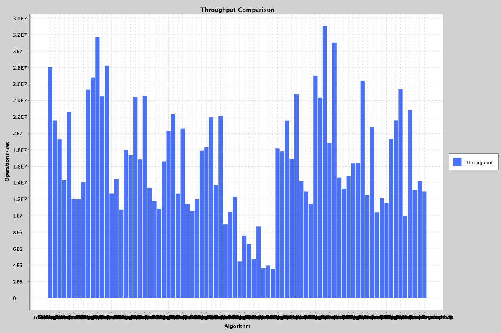
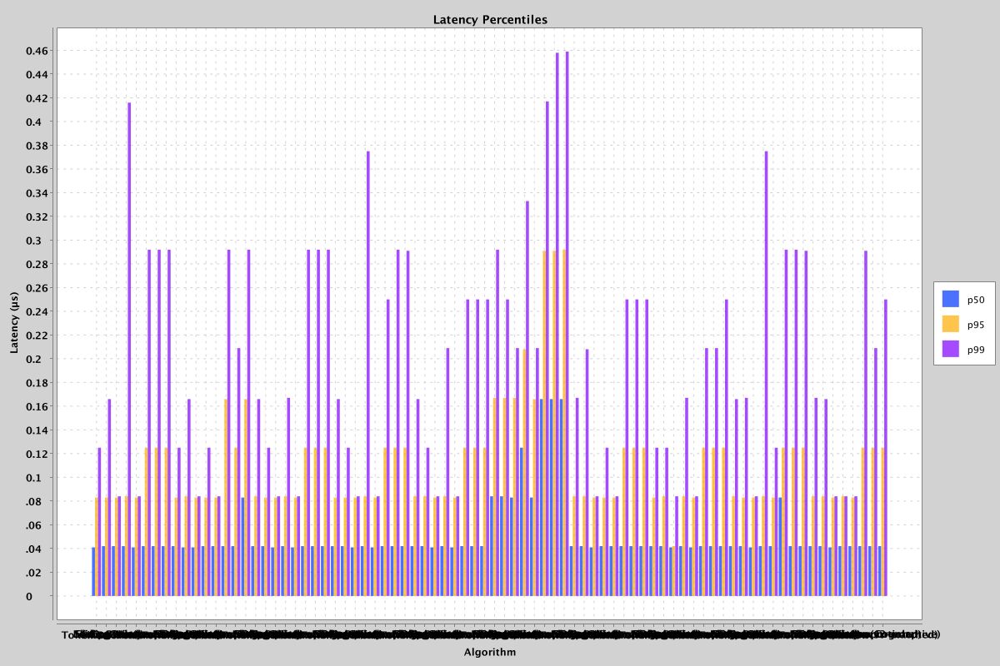
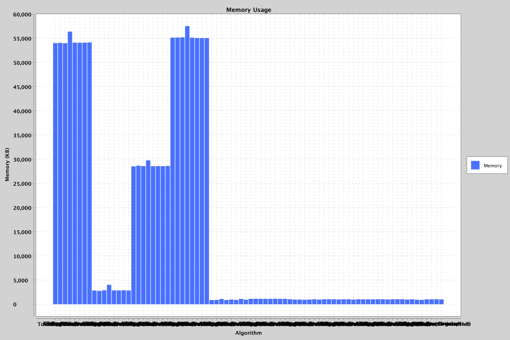
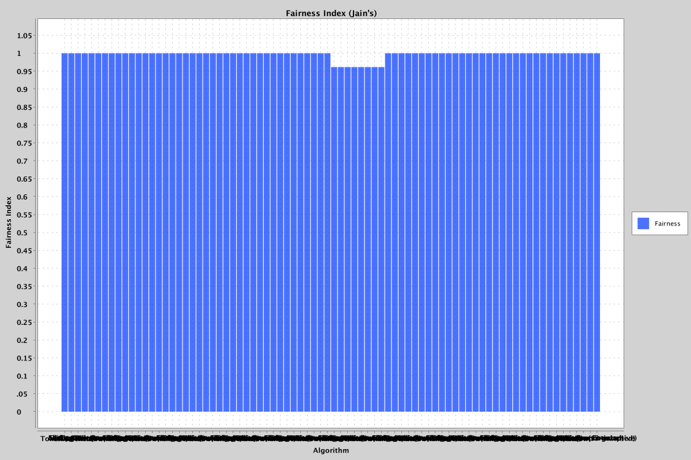

# Rate Limiter Benchmark Report

## Environment

| Property | Value |
|----------|-------|
| Timestamp | 2026-09-01T09:10:38.859729Z |
| OS | Mac OS X 26.5.2 aarch64 |
| CPU | Apple M3 |
| Cores | 8 |
| JDK | 21.0.9 (Oracle Corporation) |
| Total RAM | 8192 MB |

## Configuration

| Parameter | Value |
|-----------|-------|
| Profile | stress |
| Rate Limit | 50000 |
| Window Size | 1000 ms |
| Clients | 2000 |
| Duration | 30 s |
| Warmup Runs | 3 |
| Measurement Runs | 5 |
| Seed | 98765 |

## Algorithms Tested

- Token Bucket
- Leaky Bucket
- Fixed Window
- Sliding Window Log
- Sliding Window Counter
- Custom (proportional)
- Custom (burst-matched)
- Custom (v2-adaptive)

## Workloads

- constant
- burst
- periodic_burst
- random
- spike
- multi_client
- adversarial
- idle_then_burst
- chronic_edge_rider
- repeated_burst_abuser

## Correctness Results

| Algorithm | Workload | Violations |
|-----------|----------|------------|
| Token Bucket | constant | 0 |
| Leaky Bucket | constant | 0 |
| Fixed Window | constant | 0 |
| Sliding Window Log | constant | 0 |
| Sliding Window Counter | constant | 0 |
| Custom (proportional) | constant | 0 |
| Custom (burst-matched) | constant | 0 |
| Custom (v2-adaptive) | constant | 0 |
| Token Bucket | burst | 0 |
| Leaky Bucket | burst | 0 |
| Fixed Window | burst | 0 |
| Sliding Window Log | burst | 0 |
| Sliding Window Counter | burst | 0 |
| Custom (proportional) | burst | 0 |
| Custom (burst-matched) | burst | 0 |
| Custom (v2-adaptive) | burst | 0 |
| Token Bucket | periodic_burst | 0 |
| Leaky Bucket | periodic_burst | 0 |
| Fixed Window | periodic_burst | 0 |
| Sliding Window Log | periodic_burst | 0 |
| Sliding Window Counter | periodic_burst | 0 |
| Custom (proportional) | periodic_burst | 0 |
| Custom (burst-matched) | periodic_burst | 0 |
| Custom (v2-adaptive) | periodic_burst | 0 |
| Token Bucket | random | 0 |
| Leaky Bucket | random | 0 |
| Fixed Window | random | 0 |
| Sliding Window Log | random | 0 |
| Sliding Window Counter | random | 0 |
| Custom (proportional) | random | 0 |
| Custom (burst-matched) | random | 0 |
| Custom (v2-adaptive) | random | 0 |
| Token Bucket | spike | 0 |
| Leaky Bucket | spike | 0 |
| Fixed Window | spike | 0 |
| Sliding Window Log | spike | 0 |
| Sliding Window Counter | spike | 0 |
| Custom (proportional) | spike | 0 |
| Custom (burst-matched) | spike | 0 |
| Custom (v2-adaptive) | spike | 0 |
| Token Bucket | multi_client | 0 |
| Leaky Bucket | multi_client | 0 |
| Fixed Window | multi_client | 0 |
| Sliding Window Log | multi_client | 0 |
| Sliding Window Counter | multi_client | 0 |
| Custom (proportional) | multi_client | 0 |
| Custom (burst-matched) | multi_client | 0 |
| Custom (v2-adaptive) | multi_client | 0 |
| Token Bucket | adversarial | 0 |
| Leaky Bucket | adversarial | 0 |
| Fixed Window | adversarial | 0 |
| Sliding Window Log | adversarial | 0 |
| Sliding Window Counter | adversarial | 0 |
| Custom (proportional) | adversarial | 0 |
| Custom (burst-matched) | adversarial | 0 |
| Custom (v2-adaptive) | adversarial | 0 |
| Token Bucket | idle_then_burst | 0 |
| Leaky Bucket | idle_then_burst | 0 |
| Fixed Window | idle_then_burst | 0 |
| Sliding Window Log | idle_then_burst | 0 |
| Sliding Window Counter | idle_then_burst | 0 |
| Custom (proportional) | idle_then_burst | 0 |
| Custom (burst-matched) | idle_then_burst | 0 |
| Custom (v2-adaptive) | idle_then_burst | 0 |
| Token Bucket | chronic_edge_rider | 0 |
| Leaky Bucket | chronic_edge_rider | 0 |
| Fixed Window | chronic_edge_rider | 0 |
| Sliding Window Log | chronic_edge_rider | 0 |
| Sliding Window Counter | chronic_edge_rider | 0 |
| Custom (proportional) | chronic_edge_rider | 0 |
| Custom (burst-matched) | chronic_edge_rider | 0 |
| Custom (v2-adaptive) | chronic_edge_rider | 0 |
| Token Bucket | repeated_burst_abuser | 0 |
| Leaky Bucket | repeated_burst_abuser | 0 |
| Fixed Window | repeated_burst_abuser | 0 |
| Sliding Window Log | repeated_burst_abuser | 0 |
| Sliding Window Counter | repeated_burst_abuser | 0 |
| Custom (proportional) | repeated_burst_abuser | 0 |
| Custom (burst-matched) | repeated_burst_abuser | 0 |
| Custom (v2-adaptive) | repeated_burst_abuser | 0 |

## Performance Results

| Algorithm | Workload | Throughput (ops/s) | Avg Latency (ns) | p50 (ns) | p95 (ns) | p99 (ns) | Max (ns) |
|-----------|----------|--------------------|-------------------|----------|----------|----------|----------|
| Token Bucket | constant | 28,047,927.19 | 38.88 | 41.00 | 83.00 | 125.00 | 5,291.00 |
| Leaky Bucket | constant | 21,564,587.59 | 39.47 | 42.00 | 83.00 | 166.00 | 13,000.00 |
| Fixed Window | constant | 19,321,421.81 | 40.56 | 42.00 | 83.00 | 84.00 | 92,458.00 |
| Sliding Window Log | constant | 14,306,981.73 | 52.77 | 42.00 | 84.00 | 416.00 | 14,125.00 |
| Sliding Window Counter | constant | 22,635,111.29 | 37.16 | 41.00 | 83.00 | 84.00 | 63,250.00 |
| Custom (proportional) | constant | 12,071,873.01 | 77.64 | 42.00 | 125.00 | 292.00 | 117,500.00 |
| Custom (burst-matched) | constant | 11,981,351.65 | 72.46 | 42.00 | 125.00 | 292.00 | 211,375.00 |
| Custom (v2-adaptive) | constant | 14,047,013.72 | 78.06 | 42.00 | 125.00 | 292.00 | 51,958.00 |
| Token Bucket | burst | 25,299,514.88 | 40.54 | 42.00 | 83.00 | 125.00 | 60,583.00 |
| Leaky Bucket | burst | 26,766,466.08 | 37.67 | 41.00 | 84.00 | 166.00 | 15,834.00 |
| Fixed Window | burst | 31,747,996.67 | 31.81 | 41.00 | 83.00 | 84.00 | 10,292.00 |
| Sliding Window Log | burst | 24,513,265.39 | 41.72 | 42.00 | 83.00 | 125.00 | 20,833.00 |
| Sliding Window Counter | burst | 28,228,559.42 | 37.13 | 42.00 | 83.00 | 84.00 | 20,709.00 |
| Custom (proportional) | burst | 12,711,007.39 | 91.84 | 42.00 | 166.00 | 292.00 | 121,459.00 |
| Custom (burst-matched) | burst | 14,441,602.06 | 72.72 | 42.00 | 125.00 | 209.00 | 83,667.00 |
| Custom (v2-adaptive) | burst | 10,726,590.73 | 109.31 | 83.00 | 166.00 | 292.00 | 960,625.00 |
| Token Bucket | periodic_burst | 17,996,283.27 | 66.48 | 42.00 | 84.00 | 166.00 | 6,606,167.00 |
| Leaky Bucket | periodic_burst | 17,354,490.83 | 53.03 | 42.00 | 83.00 | 125.00 | 411,334.00 |
| Fixed Window | periodic_burst | 24,441,236.41 | 35.89 | 41.00 | 83.00 | 84.00 | 23,208.00 |
| Sliding Window Log | periodic_burst | 16,824,118.87 | 68.87 | 42.00 | 84.00 | 167.00 | 4,482,625.00 |
| Sliding Window Counter | periodic_burst | 24,545,455.75 | 48.57 | 41.00 | 83.00 | 84.00 | 44,541.00 |
| Custom (proportional) | periodic_burst | 13,393,294.21 | 94.61 | 42.00 | 125.00 | 292.00 | 1,649,333.00 |
| Custom (burst-matched) | periodic_burst | 11,751,763.33 | 82.66 | 42.00 | 125.00 | 292.00 | 189,875.00 |
| Custom (v2-adaptive) | periodic_burst | 10,870,287.95 | 85.14 | 42.00 | 125.00 | 292.00 | 148,083.00 |
| Token Bucket | random | 16,606,933.31 | 44.54 | 42.00 | 83.00 | 166.00 | 661,583.00 |
| Leaky Bucket | random | 20,319,207.58 | 41.29 | 42.00 | 83.00 | 125.00 | 17,083.00 |
| Fixed Window | random | 22,313,723.29 | 36.63 | 41.00 | 83.00 | 84.00 | 495,125.00 |
| Sliding Window Log | random | 12,709,448.64 | 60.22 | 42.00 | 84.00 | 375.00 | 397,209.00 |
| Sliding Window Counter | random | 20,588,742.57 | 38.62 | 41.00 | 83.00 | 84.00 | 88,041.00 |
| Custom (proportional) | random | 11,452,341.33 | 91.69 | 42.00 | 125.00 | 250.00 | 29,958.00 |
| Custom (burst-matched) | random | 10,561,999.78 | 84.85 | 42.00 | 125.00 | 292.00 | 236,834.00 |
| Custom (v2-adaptive) | random | 11,990,492.92 | 88.53 | 42.00 | 125.00 | 291.00 | 43,375.00 |
| Token Bucket | spike | 17,919,141.69 | 55.98 | 42.00 | 84.00 | 166.00 | 34,125.00 |
| Leaky Bucket | spike | 18,300,769.40 | 48.93 | 42.00 | 84.00 | 125.00 | 26,708.00 |
| Fixed Window | spike | 21,939,248.90 | 62.51 | 41.00 | 83.00 | 84.00 | 56,292.00 |
| Sliding Window Log | spike | 13,703,610.75 | 62.83 | 42.00 | 84.00 | 209.00 | 94,166.00 |
| Sliding Window Counter | spike | 22,141,747.84 | 43.78 | 41.00 | 83.00 | 84.00 | 50,084.00 |
| Custom (proportional) | spike | 8,939,784.44 | 88.27 | 42.00 | 125.00 | 250.00 | 218,750.00 |
| Custom (burst-matched) | spike | 10,442,694.83 | 110.74 | 42.00 | 125.00 | 250.00 | 3,636,041.00 |
| Custom (v2-adaptive) | spike | 12,284,465.07 | 91.56 | 42.00 | 125.00 | 250.00 | 58,292.00 |
| Token Bucket | multi_client | 4,425,825.56 | 1,016.29 | 84.00 | 167.00 | 292.00 | 289,434,125.00 |
| Leaky Bucket | multi_client | 7,568,623.24 | 126.74 | 84.00 | 167.00 | 250.00 | 1,176,750.00 |
| Fixed Window | multi_client | 6,534,406.14 | 217.75 | 83.00 | 167.00 | 209.00 | 121,625.00 |
| Sliding Window Log | multi_client | 4,713,428.58 | 1,116.34 | 125.00 | 208.00 | 333.00 | 224,728,958.00 |
| Sliding Window Counter | multi_client | 8,676,197.78 | 101.49 | 83.00 | 166.00 | 209.00 | 15,125.00 |
| Custom (proportional) | multi_client | 3,597,810.39 | 357.25 | 166.00 | 291.00 | 417.00 | 44,120,333.00 |
| Custom (burst-matched) | multi_client | 3,971,985.77 | 190.50 | 166.00 | 291.00 | 458.00 | 28,584.00 |
| Custom (v2-adaptive) | multi_client | 3,504,689.48 | 264.69 | 166.00 | 292.00 | 459.00 | 7,009,208.00 |
| Token Bucket | adversarial | 18,186,827.97 | 67.55 | 42.00 | 84.00 | 167.00 | 37,750.00 |
| Leaky Bucket | adversarial | 17,838,624.30 | 43.63 | 42.00 | 84.00 | 208.00 | 8,375.00 |
| Fixed Window | adversarial | 21,554,692.71 | 36.99 | 41.00 | 83.00 | 84.00 | 105,792.00 |
| Sliding Window Log | adversarial | 16,901,976.03 | 49.36 | 42.00 | 83.00 | 125.00 | 255,625.00 |
| Sliding Window Counter | adversarial | 24,772,930.83 | 36.85 | 42.00 | 83.00 | 84.00 | 22,083.00 |
| Custom (proportional) | adversarial | 14,160,112.29 | 95.04 | 42.00 | 125.00 | 250.00 | 19,958.00 |
| Custom (burst-matched) | adversarial | 12,913,077.70 | 64.94 | 42.00 | 125.00 | 250.00 | 29,458.00 |
| Custom (v2-adaptive) | adversarial | 11,470,337.03 | 93.99 | 42.00 | 125.00 | 250.00 | 6,528,667.00 |
| Token Bucket | idle_then_burst | 27,005,719.67 | 37.16 | 42.00 | 83.00 | 125.00 | 9,375.00 |
| Leaky Bucket | idle_then_burst | 24,335,319.46 | 41.82 | 42.00 | 84.00 | 125.00 | 121,000.00 |
| Fixed Window | idle_then_burst | 33,065,760.79 | 30.46 | 41.00 | 42.00 | 84.00 | 14,458.00 |
| Sliding Window Log | idle_then_burst | 18,836,411.89 | 53.51 | 42.00 | 84.00 | 167.00 | 11,083.00 |
| Sliding Window Counter | idle_then_burst | 31,004,686.20 | 32.52 | 41.00 | 83.00 | 84.00 | 73,083.00 |
| Custom (proportional) | idle_then_burst | 14,627,891.58 | 69.95 | 42.00 | 125.00 | 209.00 | 117,666.00 |
| Custom (burst-matched) | idle_then_burst | 13,302,484.84 | 81.36 | 42.00 | 125.00 | 209.00 | 1,737,292.00 |
| Custom (v2-adaptive) | idle_then_burst | 14,776,237.54 | 67.99 | 42.00 | 125.00 | 250.00 | 24,334.00 |
| Token Bucket | chronic_edge_rider | 16,368,514.86 | 45.25 | 42.00 | 84.00 | 166.00 | 662,000.00 |
| Leaky Bucket | chronic_edge_rider | 16,394,547.57 | 48.23 | 42.00 | 83.00 | 167.00 | 81,375.00 |
| Fixed Window | chronic_edge_rider | 26,393,574.08 | 36.94 | 41.00 | 83.00 | 84.00 | 7,583.00 |
| Sliding Window Log | chronic_edge_rider | 12,505,951.63 | 52.13 | 42.00 | 84.00 | 375.00 | 33,792.00 |
| Sliding Window Counter | chronic_edge_rider | 20,797,383.40 | 39.73 | 42.00 | 83.00 | 125.00 | 62,625.00 |
| Custom (proportional) | chronic_edge_rider | 10,397,208.94 | 101.94 | 83.00 | 125.00 | 292.00 | 769,209.00 |
| Custom (burst-matched) | chronic_edge_rider | 12,129,977.18 | 74.64 | 42.00 | 125.00 | 292.00 | 945,542.00 |
| Custom (v2-adaptive) | chronic_edge_rider | 11,563,186.83 | 72.38 | 42.00 | 125.00 | 291.00 | 443,084.00 |
| Token Bucket | repeated_burst_abuser | 19,321,387.82 | 76.57 | 42.00 | 84.00 | 167.00 | 17,773,875.00 |
| Leaky Bucket | repeated_burst_abuser | 21,571,313.80 | 54.43 | 42.00 | 84.00 | 166.00 | 12,458.00 |
| Fixed Window | repeated_burst_abuser | 25,372,137.57 | 35.57 | 41.00 | 83.00 | 84.00 | 6,750.00 |
| Sliding Window Log | repeated_burst_abuser | 9,910,404.73 | 59.69 | 42.00 | 84.00 | 84.00 | 43,625.00 |
| Sliding Window Counter | repeated_burst_abuser | 22,838,597.30 | 38.26 | 42.00 | 83.00 | 84.00 | 75,667.00 |
| Custom (proportional) | repeated_burst_abuser | 13,141,209.84 | 72.43 | 42.00 | 125.00 | 291.00 | 54,084.00 |
| Custom (burst-matched) | repeated_burst_abuser | 14,179,899.70 | 82.59 | 42.00 | 125.00 | 209.00 | 29,958.00 |
| Custom (v2-adaptive) | repeated_burst_abuser | 12,914,827.44 | 82.32 | 42.00 | 125.00 | 250.00 | 1,938,333.00 |

## Memory Results

| Algorithm | Workload | Memory Used (bytes) | Per Client (bytes) |
|-----------|----------|---------------------|--------------------|
| Token Bucket | constant | 55,308,289 | 27,654 |
| Leaky Bucket | constant | 55,328,529 | 27,664 |
| Fixed Window | constant | 55,268,324 | 27,634 |
| Sliding Window Log | constant | 57,725,425 | 28,862 |
| Sliding Window Counter | constant | 55,380,268 | 27,690 |
| Custom (proportional) | constant | 55,377,756 | 27,688 |
| Custom (burst-matched) | constant | 55,382,409 | 27,691 |
| Custom (v2-adaptive) | constant | 55,438,464 | 27,719 |
| Token Bucket | burst | 2,896,105 | 1,448 |
| Leaky Bucket | burst | 2,823,667 | 1,411 |
| Fixed Window | burst | 2,943,732 | 1,471 |
| Sliding Window Log | burst | 4,120,081 | 2,060 |
| Sliding Window Counter | burst | 2,924,561 | 1,462 |
| Custom (proportional) | burst | 2,923,420 | 1,461 |
| Custom (burst-matched) | burst | 2,959,752 | 1,479 |
| Custom (v2-adaptive) | burst | 2,906,704 | 1,453 |
| Token Bucket | periodic_burst | 29,182,712 | 14,591 |
| Leaky Bucket | periodic_burst | 29,338,342 | 14,669 |
| Fixed Window | periodic_burst | 29,258,608 | 14,629 |
| Sliding Window Log | periodic_burst | 30,470,201 | 15,235 |
| Sliding Window Counter | periodic_burst | 29,227,788 | 14,613 |
| Custom (proportional) | periodic_burst | 29,258,140 | 14,629 |
| Custom (burst-matched) | periodic_burst | 29,230,996 | 14,615 |
| Custom (v2-adaptive) | periodic_burst | 29,275,249 | 14,637 |
| Token Bucket | random | 56,467,465 | 28,233 |
| Leaky Bucket | random | 56,471,601 | 28,235 |
| Fixed Window | random | 56,514,201 | 28,257 |
| Sliding Window Log | random | 58,890,104 | 29,445 |
| Sliding Window Counter | random | 56,440,254 | 28,220 |
| Custom (proportional) | random | 56,367,480 | 28,183 |
| Custom (burst-matched) | random | 56,361,819 | 28,180 |
| Custom (v2-adaptive) | random | 56,361,008 | 28,180 |
| Token Bucket | spike | 887,329 | 443 |
| Leaky Bucket | spike | 904,107 | 452 |
| Fixed Window | spike | 1,113,825 | 556 |
| Sliding Window Log | spike | 891,652 | 445 |
| Sliding Window Counter | spike | 983,932 | 491 |
| Custom (proportional) | spike | 914,433 | 457 |
| Custom (burst-matched) | spike | 1,126,240 | 563 |
| Custom (v2-adaptive) | spike | 950,059 | 475 |
| Token Bucket | multi_client | 1,152,539 | 576 |
| Leaky Bucket | multi_client | 1,162,953 | 581 |
| Fixed Window | multi_client | 1,139,142 | 569 |
| Sliding Window Log | multi_client | 1,149,412 | 574 |
| Sliding Window Counter | multi_client | 1,144,476 | 572 |
| Custom (proportional) | multi_client | 1,164,792 | 582 |
| Custom (burst-matched) | multi_client | 1,147,894 | 573 |
| Custom (v2-adaptive) | multi_client | 1,149,417 | 574 |
| Token Bucket | adversarial | 1,048,924 | 524 |
| Leaky Bucket | adversarial | 992,280 | 496 |
| Fixed Window | adversarial | 998,580 | 499 |
| Sliding Window Log | adversarial | 950,337 | 475 |
| Sliding Window Counter | adversarial | 1,002,755 | 501 |
| Custom (proportional) | adversarial | 1,048,737 | 524 |
| Custom (burst-matched) | adversarial | 990,028 | 495 |
| Custom (v2-adaptive) | adversarial | 1,048,723 | 524 |
| Token Bucket | idle_then_burst | 1,048,819 | 524 |
| Leaky Bucket | idle_then_burst | 1,048,824 | 524 |
| Fixed Window | idle_then_burst | 1,013,169 | 506 |
| Sliding Window Log | idle_then_burst | 1,048,824 | 524 |
| Sliding Window Counter | idle_then_burst | 1,048,819 | 524 |
| Custom (proportional) | idle_then_burst | 973,155 | 486 |
| Custom (burst-matched) | idle_then_burst | 1,048,656 | 524 |
| Custom (v2-adaptive) | idle_then_burst | 1,048,627 | 524 |
| Token Bucket | chronic_edge_rider | 1,042,625 | 521 |
| Leaky Bucket | chronic_edge_rider | 1,040,537 | 520 |
| Fixed Window | chronic_edge_rider | 1,048,900 | 524 |
| Sliding Window Log | chronic_edge_rider | 1,048,929 | 524 |
| Sliding Window Counter | chronic_edge_rider | 1,025,843 | 512 |
| Custom (proportional) | chronic_edge_rider | 1,048,819 | 524 |
| Custom (burst-matched) | chronic_edge_rider | 1,048,761 | 524 |
| Custom (v2-adaptive) | chronic_edge_rider | 1,048,732 | 524 |
| Token Bucket | repeated_burst_abuser | 983,924 | 491 |
| Leaky Bucket | repeated_burst_abuser | 1,048,939 | 524 |
| Fixed Window | repeated_burst_abuser | 952,457 | 476 |
| Sliding Window Log | repeated_burst_abuser | 925,276 | 462 |
| Sliding Window Counter | repeated_burst_abuser | 1,046,632 | 523 |
| Custom (proportional) | repeated_burst_abuser | 1,052,172 | 526 |
| Custom (burst-matched) | repeated_burst_abuser | 1,048,790 | 524 |
| Custom (v2-adaptive) | repeated_burst_abuser | 1,036,185 | 518 |

## Fairness Results

| Algorithm | Workload | Jain's Fairness Index |
|-----------|----------|-----------------------|
| Token Bucket | constant | 1.0000 |
| Leaky Bucket | constant | 1.0000 |
| Fixed Window | constant | 1.0000 |
| Sliding Window Log | constant | 1.0000 |
| Sliding Window Counter | constant | 1.0000 |
| Custom (proportional) | constant | 1.0000 |
| Custom (burst-matched) | constant | 1.0000 |
| Custom (v2-adaptive) | constant | 1.0000 |
| Token Bucket | burst | 1.0000 |
| Leaky Bucket | burst | 1.0000 |
| Fixed Window | burst | 1.0000 |
| Sliding Window Log | burst | 1.0000 |
| Sliding Window Counter | burst | 1.0000 |
| Custom (proportional) | burst | 1.0000 |
| Custom (burst-matched) | burst | 1.0000 |
| Custom (v2-adaptive) | burst | 1.0000 |
| Token Bucket | periodic_burst | 1.0000 |
| Leaky Bucket | periodic_burst | 1.0000 |
| Fixed Window | periodic_burst | 1.0000 |
| Sliding Window Log | periodic_burst | 1.0000 |
| Sliding Window Counter | periodic_burst | 1.0000 |
| Custom (proportional) | periodic_burst | 1.0000 |
| Custom (burst-matched) | periodic_burst | 1.0000 |
| Custom (v2-adaptive) | periodic_burst | 1.0000 |
| Token Bucket | random | 1.0000 |
| Leaky Bucket | random | 1.0000 |
| Fixed Window | random | 1.0000 |
| Sliding Window Log | random | 1.0000 |
| Sliding Window Counter | random | 1.0000 |
| Custom (proportional) | random | 1.0000 |
| Custom (burst-matched) | random | 1.0000 |
| Custom (v2-adaptive) | random | 1.0000 |
| Token Bucket | spike | 1.0000 |
| Leaky Bucket | spike | 1.0000 |
| Fixed Window | spike | 1.0000 |
| Sliding Window Log | spike | 1.0000 |
| Sliding Window Counter | spike | 1.0000 |
| Custom (proportional) | spike | 1.0000 |
| Custom (burst-matched) | spike | 1.0000 |
| Custom (v2-adaptive) | spike | 1.0000 |
| Token Bucket | multi_client | 0.9614 |
| Leaky Bucket | multi_client | 0.9614 |
| Fixed Window | multi_client | 0.9614 |
| Sliding Window Log | multi_client | 0.9614 |
| Sliding Window Counter | multi_client | 0.9614 |
| Custom (proportional) | multi_client | 0.9614 |
| Custom (burst-matched) | multi_client | 0.9614 |
| Custom (v2-adaptive) | multi_client | 0.9614 |
| Token Bucket | adversarial | 1.0000 |
| Leaky Bucket | adversarial | 1.0000 |
| Fixed Window | adversarial | 1.0000 |
| Sliding Window Log | adversarial | 1.0000 |
| Sliding Window Counter | adversarial | 1.0000 |
| Custom (proportional) | adversarial | 1.0000 |
| Custom (burst-matched) | adversarial | 1.0000 |
| Custom (v2-adaptive) | adversarial | 1.0000 |
| Token Bucket | idle_then_burst | 1.0000 |
| Leaky Bucket | idle_then_burst | 1.0000 |
| Fixed Window | idle_then_burst | 1.0000 |
| Sliding Window Log | idle_then_burst | 1.0000 |
| Sliding Window Counter | idle_then_burst | 1.0000 |
| Custom (proportional) | idle_then_burst | 1.0000 |
| Custom (burst-matched) | idle_then_burst | 1.0000 |
| Custom (v2-adaptive) | idle_then_burst | 1.0000 |
| Token Bucket | chronic_edge_rider | 1.0000 |
| Leaky Bucket | chronic_edge_rider | 1.0000 |
| Fixed Window | chronic_edge_rider | 1.0000 |
| Sliding Window Log | chronic_edge_rider | 1.0000 |
| Sliding Window Counter | chronic_edge_rider | 1.0000 |
| Custom (proportional) | chronic_edge_rider | 1.0000 |
| Custom (burst-matched) | chronic_edge_rider | 1.0000 |
| Custom (v2-adaptive) | chronic_edge_rider | 1.0000 |
| Token Bucket | repeated_burst_abuser | 1.0000 |
| Leaky Bucket | repeated_burst_abuser | 1.0000 |
| Fixed Window | repeated_burst_abuser | 1.0000 |
| Sliding Window Log | repeated_burst_abuser | 1.0000 |
| Sliding Window Counter | repeated_burst_abuser | 1.0000 |
| Custom (proportional) | repeated_burst_abuser | 1.0000 |
| Custom (burst-matched) | repeated_burst_abuser | 1.0000 |
| Custom (v2-adaptive) | repeated_burst_abuser | 1.0000 |

## Graphs

## Summary

Results represent relative comparisons on this specific machine. See the performance table above for detailed metrics.

- On `random`, Fixed Window achieved 22,313,723 ops/sec vs Custom (burst-matched)'s 10,562,000 ops/sec (+111.3%)
- On `constant`, Token Bucket achieved 28,047,927 ops/sec vs Custom (burst-matched)'s 11,981,352 ops/sec (+134.1%)
- On `idle_then_burst`, Fixed Window achieved 33,065,761 ops/sec vs Custom (burst-matched)'s 13,302,485 ops/sec (+148.6%)
- On `multi_client`, Sliding Window Counter achieved 8,676,198 ops/sec vs Custom (v2-adaptive)'s 3,504,689 ops/sec (+147.6%)
- On `chronic_edge_rider`, Fixed Window achieved 26,393,574 ops/sec vs Custom (proportional)'s 10,397,209 ops/sec (+153.9%)
- On `adversarial`, Sliding Window Counter achieved 24,772,931 ops/sec vs Custom (v2-adaptive)'s 11,470,337 ops/sec (+116.0%)
- On `burst`, Fixed Window achieved 31,747,997 ops/sec vs Custom (v2-adaptive)'s 10,726,591 ops/sec (+196.0%)
- On `repeated_burst_abuser`, Fixed Window achieved 25,372,138 ops/sec vs Sliding Window Log's 9,910,405 ops/sec (+156.0%)
- On `periodic_burst`, Sliding Window Counter achieved 24,545,456 ops/sec vs Custom (v2-adaptive)'s 10,870,288 ops/sec (+125.8%)
- On `spike`, Sliding Window Counter achieved 22,141,748 ops/sec vs Custom (proportional)'s 8,939,784 ops/sec (+147.7%)

## Limitations

- This benchmark performs **single-machine relative comparisons**. Absolute numbers are not transferable across machines.
- CPU and memory measurements are approximate (see docs/metrics.md).
- GC activity may affect individual run latency.
