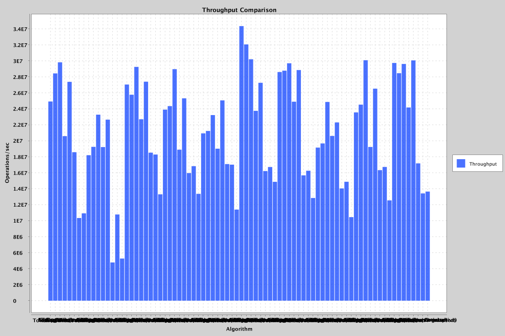
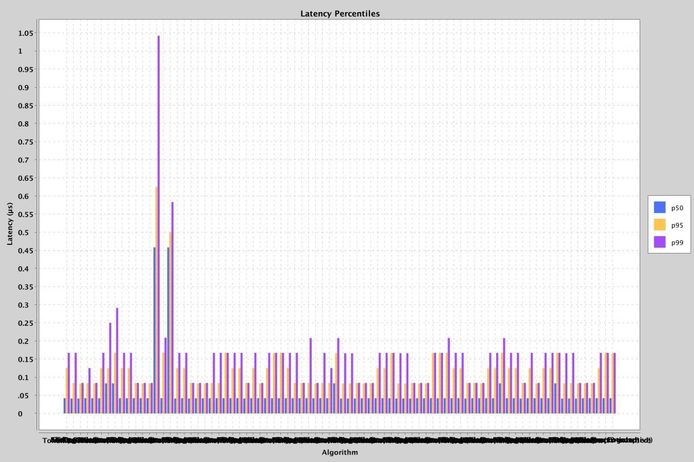
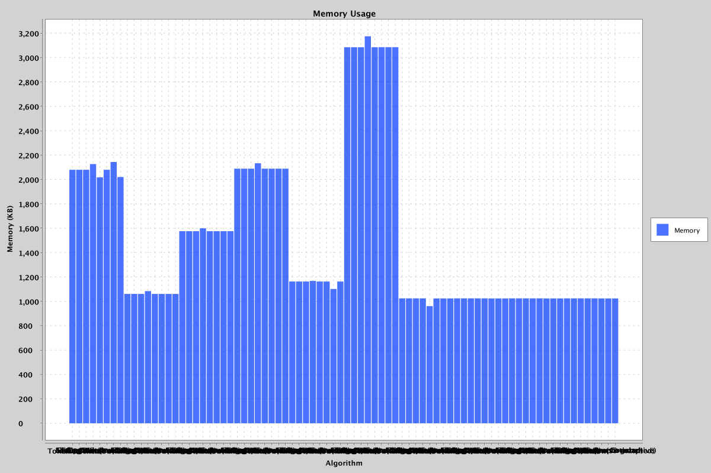
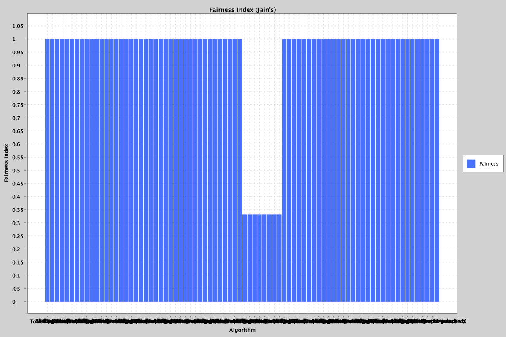
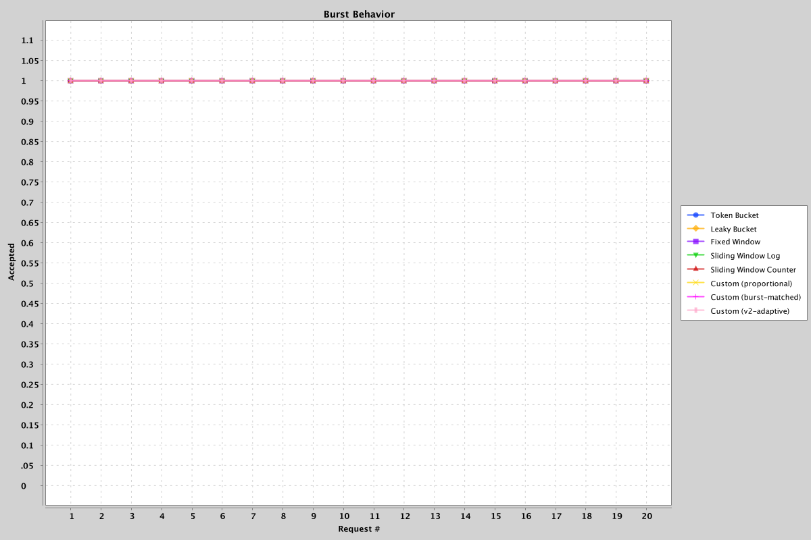

# Rate Limiter Benchmark Report

## Environment

| Property | Value |
|----------|-------|
| Timestamp | 2026-09-01T21:33:33.460917Z |
| OS | Mac OS X 26.5.2 aarch64 |
| CPU | Apple M3 |
| Cores | 8 |
| JDK | 26.0.2 (Homebrew) |
| Total RAM | 8192 MB |

## Configuration

| Parameter | Value |
|-----------|-------|
| Profile | standard |
| Rate Limit | 1000 |
| Window Size | 1000 ms |
| Clients | 10 |
| Duration | 30 s |
| Warmup Runs | 3 |
| Measurement Runs | 5 |
| Seed | 12345 |

## Algorithms Tested

- Token Bucket
- Leaky Bucket
- Fixed Window
- Sliding Window Log
- Sliding Window Counter
- Custom (proportional)
- Custom (burst-matched)
- Custom (v2-adaptive)

## Workloads

- constant
- burst
- periodic_burst
- random
- spike
- multi_client
- adversarial
- idle_then_burst
- chronic_edge_rider
- repeated_burst_abuser

## Correctness Results

| Algorithm | Workload | Violations |
|-----------|----------|------------|
| Token Bucket | constant | 0 |
| Leaky Bucket | constant | 0 |
| Fixed Window | constant | 0 |
| Sliding Window Log | constant | 0 |
| Sliding Window Counter | constant | 0 |
| Custom (proportional) | constant | 0 |
| Custom (burst-matched) | constant | 0 |
| Custom (v2-adaptive) | constant | 0 |
| Token Bucket | burst | 0 |
| Leaky Bucket | burst | 0 |
| Fixed Window | burst | 0 |
| Sliding Window Log | burst | 0 |
| Sliding Window Counter | burst | 0 |
| Custom (proportional) | burst | 0 |
| Custom (burst-matched) | burst | 0 |
| Custom (v2-adaptive) | burst | 0 |
| Token Bucket | periodic_burst | 0 |
| Leaky Bucket | periodic_burst | 0 |
| Fixed Window | periodic_burst | 0 |
| Sliding Window Log | periodic_burst | 0 |
| Sliding Window Counter | periodic_burst | 0 |
| Custom (proportional) | periodic_burst | 0 |
| Custom (burst-matched) | periodic_burst | 0 |
| Custom (v2-adaptive) | periodic_burst | 0 |
| Token Bucket | random | 0 |
| Leaky Bucket | random | 0 |
| Fixed Window | random | 0 |
| Sliding Window Log | random | 0 |
| Sliding Window Counter | random | 0 |
| Custom (proportional) | random | 0 |
| Custom (burst-matched) | random | 0 |
| Custom (v2-adaptive) | random | 0 |
| Token Bucket | spike | 0 |
| Leaky Bucket | spike | 0 |
| Fixed Window | spike | 0 |
| Sliding Window Log | spike | 0 |
| Sliding Window Counter | spike | 0 |
| Custom (proportional) | spike | 0 |
| Custom (burst-matched) | spike | 0 |
| Custom (v2-adaptive) | spike | 0 |
| Token Bucket | multi_client | 0 |
| Leaky Bucket | multi_client | 0 |
| Fixed Window | multi_client | 0 |
| Sliding Window Log | multi_client | 0 |
| Sliding Window Counter | multi_client | 0 |
| Custom (proportional) | multi_client | 0 |
| Custom (burst-matched) | multi_client | 0 |
| Custom (v2-adaptive) | multi_client | 0 |
| Token Bucket | adversarial | 0 |
| Leaky Bucket | adversarial | 0 |
| Fixed Window | adversarial | 0 |
| Sliding Window Log | adversarial | 0 |
| Sliding Window Counter | adversarial | 0 |
| Custom (proportional) | adversarial | 0 |
| Custom (burst-matched) | adversarial | 0 |
| Custom (v2-adaptive) | adversarial | 0 |
| Token Bucket | idle_then_burst | 0 |
| Leaky Bucket | idle_then_burst | 0 |
| Fixed Window | idle_then_burst | 0 |
| Sliding Window Log | idle_then_burst | 0 |
| Sliding Window Counter | idle_then_burst | 0 |
| Custom (proportional) | idle_then_burst | 0 |
| Custom (burst-matched) | idle_then_burst | 0 |
| Custom (v2-adaptive) | idle_then_burst | 0 |
| Token Bucket | chronic_edge_rider | 0 |
| Leaky Bucket | chronic_edge_rider | 0 |
| Fixed Window | chronic_edge_rider | 0 |
| Sliding Window Log | chronic_edge_rider | 0 |
| Sliding Window Counter | chronic_edge_rider | 0 |
| Custom (proportional) | chronic_edge_rider | 0 |
| Custom (burst-matched) | chronic_edge_rider | 0 |
| Custom (v2-adaptive) | chronic_edge_rider | 0 |
| Token Bucket | repeated_burst_abuser | 0 |
| Leaky Bucket | repeated_burst_abuser | 0 |
| Fixed Window | repeated_burst_abuser | 0 |
| Sliding Window Log | repeated_burst_abuser | 0 |
| Sliding Window Counter | repeated_burst_abuser | 0 |
| Custom (proportional) | repeated_burst_abuser | 0 |
| Custom (burst-matched) | repeated_burst_abuser | 0 |
| Custom (v2-adaptive) | repeated_burst_abuser | 0 |

## Performance Results

| Algorithm | Workload | Throughput (ops/s) | Avg Latency (ns) | p50 (ns) | p95 (ns) | p99 (ns) | Max (ns) |
|-----------|----------|--------------------|-------------------|----------|----------|----------|----------|
| Token Bucket | constant | 24,918,466.69 | 40.16 | 42.00 | 125.00 | 167.00 | 36,084.00 |
| Leaky Bucket | constant | 28,431,700.36 | 35.66 | 41.00 | 84.00 | 167.00 | 31,500.00 |
| Fixed Window | constant | 29,819,387.84 | 33.58 | 41.00 | 83.00 | 84.00 | 24,167.00 |
| Sliding Window Log | constant | 20,581,622.22 | 48.77 | 42.00 | 84.00 | 125.00 | 17,875.00 |
| Sliding Window Counter | constant | 27,375,787.59 | 36.53 | 42.00 | 83.00 | 84.00 | 11,125.00 |
| Custom (proportional) | constant | 18,573,659.69 | 54.07 | 42.00 | 125.00 | 167.00 | 26,459.00 |
| Custom (burst-matched) | constant | 10,345,479.86 | 101.07 | 83.00 | 125.00 | 250.00 | 123,708.00 |
| Custom (v2-adaptive) | constant | 10,922,077.54 | 103.71 | 83.00 | 167.00 | 291.00 | 736,000.00 |
| Token Bucket | burst | 18,199,440.17 | 55.34 | 42.00 | 125.00 | 167.00 | 14,583.00 |
| Leaky Bucket | burst | 19,244,856.04 | 52.30 | 42.00 | 125.00 | 167.00 | 12,208.00 |
| Fixed Window | burst | 23,269,785.54 | 43.03 | 42.00 | 84.00 | 84.00 | 12,709.00 |
| Sliding Window Log | burst | 19,218,175.61 | 52.13 | 42.00 | 83.00 | 84.00 | 12,083.00 |
| Sliding Window Counter | burst | 22,647,709.10 | 44.19 | 42.00 | 83.00 | 84.00 | 9,667.00 |
| Custom (proportional) | burst | 4,782,207.63 | 395.48 | 458.00 | 625.00 | 1,042.00 | 43,584.00 |
| Custom (burst-matched) | burst | 10,784,681.82 | 95.08 | 42.00 | 167.00 | 209.00 | 44,083.00 |
| Custom (v2-adaptive) | burst | 5,274,054.77 | 348.61 | 458.00 | 500.00 | 583.00 | 34,666.00 |
| Token Bucket | periodic_burst | 27,038,482.39 | 37.65 | 41.00 | 125.00 | 167.00 | 15,459.00 |
| Leaky Bucket | periodic_burst | 25,766,661.53 | 39.25 | 42.00 | 125.00 | 167.00 | 14,458.00 |
| Fixed Window | periodic_burst | 29,247,904.56 | 34.20 | 41.00 | 84.00 | 84.00 | 11,375.00 |
| Sliding Window Log | periodic_burst | 22,694,231.27 | 44.07 | 42.00 | 83.00 | 84.00 | 11,417.00 |
| Sliding Window Counter | periodic_burst | 27,390,842.04 | 36.51 | 42.00 | 83.00 | 84.00 | 10,667.00 |
| Custom (proportional) | periodic_burst | 18,512,916.43 | 54.07 | 42.00 | 84.00 | 167.00 | 15,209.00 |
| Custom (burst-matched) | periodic_burst | 18,285,035.24 | 54.71 | 42.00 | 84.00 | 167.00 | 15,000.00 |
| Custom (v2-adaptive) | periodic_burst | 13,304,071.03 | 75.18 | 42.00 | 167.00 | 167.00 | 18,084.00 |
| Token Bucket | random | 23,899,462.34 | 41.95 | 42.00 | 125.00 | 167.00 | 14,334.00 |
| Leaky Bucket | random | 24,337,551.66 | 41.45 | 42.00 | 125.00 | 167.00 | 11,209.00 |
| Fixed Window | random | 28,966,395.83 | 34.69 | 41.00 | 84.00 | 84.00 | 17,792.00 |
| Sliding Window Log | random | 18,887,856.65 | 52.96 | 42.00 | 125.00 | 167.00 | 17,208.00 |
| Sliding Window Counter | random | 25,310,815.73 | 39.56 | 42.00 | 83.00 | 84.00 | 17,500.00 |
| Custom (proportional) | random | 15,962,424.50 | 63.29 | 42.00 | 125.00 | 167.00 | 17,500.00 |
| Custom (burst-matched) | random | 16,829,096.48 | 59.42 | 42.00 | 166.00 | 167.00 | 18,709.00 |
| Custom (v2-adaptive) | random | 13,367,997.48 | 74.82 | 42.00 | 167.00 | 167.00 | 18,958.00 |
| Token Bucket | spike | 20,930,263.47 | 47.89 | 42.00 | 125.00 | 167.00 | 12,208.00 |
| Leaky Bucket | spike | 21,232,159.79 | 47.13 | 42.00 | 84.00 | 167.00 | 10,709.00 |
| Fixed Window | spike | 23,218,927.85 | 45.63 | 42.00 | 84.00 | 84.00 | 46,250.00 |
| Sliding Window Log | spike | 19,010,730.81 | 54.49 | 42.00 | 84.00 | 208.00 | 30,583.00 |
| Sliding Window Counter | spike | 25,055,325.58 | 39.93 | 42.00 | 83.00 | 84.00 | 9,041.00 |
| Custom (proportional) | spike | 17,088,120.13 | 58.69 | 42.00 | 84.00 | 167.00 | 18,625.00 |
| Custom (burst-matched) | spike | 17,018,799.57 | 58.77 | 42.00 | 84.00 | 125.00 | 18,000.00 |
| Custom (v2-adaptive) | spike | 11,392,768.65 | 89.92 | 83.00 | 166.00 | 208.00 | 77,791.00 |
| Token Bucket | multi_client | 34,351,234.36 | 29.34 | 41.00 | 83.00 | 166.00 | 8,167.00 |
| Leaky Bucket | multi_client | 32,058,455.16 | 31.25 | 41.00 | 83.00 | 166.00 | 2,375.00 |
| Fixed Window | multi_client | 30,200,085.26 | 33.12 | 41.00 | 84.00 | 84.00 | 8,125.00 |
| Sliding Window Log | multi_client | 23,745,721.35 | 42.11 | 42.00 | 83.00 | 84.00 | 10,375.00 |
| Sliding Window Counter | multi_client | 27,258,691.52 | 36.69 | 42.00 | 83.00 | 84.00 | 7,833.00 |
| Custom (proportional) | multi_client | 16,213,337.89 | 61.94 | 42.00 | 125.00 | 167.00 | 13,666.00 |
| Custom (burst-matched) | multi_client | 16,719,993.20 | 59.94 | 42.00 | 125.00 | 167.00 | 13,167.00 |
| Custom (v2-adaptive) | multi_client | 14,868,571.93 | 67.28 | 42.00 | 166.00 | 167.00 | 14,459.00 |
| Token Bucket | adversarial | 28,602,067.81 | 35.02 | 41.00 | 83.00 | 166.00 | 8,542.00 |
| Leaky Bucket | adversarial | 28,773,303.32 | 34.86 | 41.00 | 83.00 | 166.00 | 11,625.00 |
| Fixed Window | adversarial | 29,700,501.97 | 33.68 | 41.00 | 84.00 | 84.00 | 11,167.00 |
| Sliding Window Log | adversarial | 24,893,328.45 | 40.18 | 42.00 | 83.00 | 84.00 | 11,584.00 |
| Sliding Window Counter | adversarial | 28,854,536.62 | 34.79 | 42.00 | 83.00 | 84.00 | 26,250.00 |
| Custom (proportional) | adversarial | 15,678,055.43 | 64.24 | 42.00 | 166.00 | 167.00 | 21,250.00 |
| Custom (burst-matched) | adversarial | 16,252,448.71 | 61.62 | 42.00 | 166.00 | 167.00 | 40,917.00 |
| Custom (v2-adaptive) | adversarial | 12,845,490.82 | 77.87 | 42.00 | 167.00 | 208.00 | 25,625.00 |
| Token Bucket | idle_then_burst | 19,153,267.21 | 52.24 | 42.00 | 125.00 | 167.00 | 12,833.00 |
| Leaky Bucket | idle_then_burst | 19,672,343.40 | 50.87 | 42.00 | 125.00 | 167.00 | 8,875.00 |
| Fixed Window | idle_then_burst | 24,861,703.80 | 40.24 | 41.00 | 84.00 | 84.00 | 11,583.00 |
| Sliding Window Log | idle_then_burst | 20,609,573.67 | 48.55 | 42.00 | 84.00 | 84.00 | 11,042.00 |
| Sliding Window Counter | idle_then_burst | 22,296,453.09 | 44.88 | 42.00 | 83.00 | 84.00 | 13,125.00 |
| Custom (proportional) | idle_then_burst | 14,041,835.35 | 73.58 | 42.00 | 125.00 | 167.00 | 15,625.00 |
| Custom (burst-matched) | idle_then_burst | 14,873,798.85 | 68.30 | 42.00 | 125.00 | 167.00 | 15,916.00 |
| Custom (v2-adaptive) | idle_then_burst | 10,448,663.10 | 95.79 | 83.00 | 167.00 | 208.00 | 24,625.00 |
| Token Bucket | chronic_edge_rider | 23,551,462.35 | 42.64 | 42.00 | 125.00 | 167.00 | 16,125.00 |
| Leaky Bucket | chronic_edge_rider | 24,525,992.94 | 40.95 | 42.00 | 125.00 | 167.00 | 13,000.00 |
| Fixed Window | chronic_edge_rider | 30,077,540.37 | 33.25 | 41.00 | 84.00 | 84.00 | 12,833.00 |
| Sliding Window Log | chronic_edge_rider | 19,230,349.32 | 52.03 | 42.00 | 125.00 | 167.00 | 13,959.00 |
| Sliding Window Counter | chronic_edge_rider | 26,518,464.96 | 37.74 | 42.00 | 83.00 | 84.00 | 10,917.00 |
| Custom (proportional) | chronic_edge_rider | 16,327,194.19 | 61.42 | 42.00 | 125.00 | 167.00 | 17,250.00 |
| Custom (burst-matched) | chronic_edge_rider | 16,726,561.78 | 59.79 | 42.00 | 125.00 | 167.00 | 16,958.00 |
| Custom (v2-adaptive) | chronic_edge_rider | 12,542,825.72 | 79.74 | 83.00 | 167.00 | 167.00 | 17,417.00 |
| Token Bucket | repeated_burst_abuser | 29,738,364.36 | 33.71 | 41.00 | 83.00 | 166.00 | 11,916.00 |
| Leaky Bucket | repeated_burst_abuser | 28,460,174.96 | 35.16 | 41.00 | 84.00 | 167.00 | 13,584.00 |
| Fixed Window | repeated_burst_abuser | 29,613,111.12 | 34.19 | 41.00 | 83.00 | 84.00 | 12,667.00 |
| Sliding Window Log | repeated_burst_abuser | 24,165,926.13 | 41.43 | 42.00 | 83.00 | 84.00 | 12,583.00 |
| Sliding Window Counter | repeated_burst_abuser | 30,060,112.56 | 33.27 | 42.00 | 83.00 | 84.00 | 12,167.00 |
| Custom (proportional) | repeated_burst_abuser | 17,172,328.33 | 58.26 | 42.00 | 125.00 | 167.00 | 18,125.00 |
| Custom (burst-matched) | repeated_burst_abuser | 13,415,017.59 | 74.56 | 42.00 | 167.00 | 167.00 | 15,166.00 |
| Custom (v2-adaptive) | repeated_burst_abuser | 13,649,154.85 | 73.31 | 42.00 | 166.00 | 167.00 | 19,875.00 |

## Memory Results

| Algorithm | Workload | Memory Used (bytes) | Per Client (bytes) |
|-----------|----------|---------------------|--------------------|
| Token Bucket | constant | 2,129,118 | 212,911 |
| Leaky Bucket | constant | 2,129,088 | 212,908 |
| Fixed Window | constant | 2,129,088 | 212,908 |
| Sliding Window Log | constant | 2,177,104 | 217,710 |
| Sliding Window Counter | constant | 2,066,177 | 206,617 |
| Custom (proportional) | constant | 2,129,112 | 212,911 |
| Custom (burst-matched) | constant | 2,194,126 | 219,412 |
| Custom (v2-adaptive) | constant | 2,068,062 | 206,806 |
| Token Bucket | burst | 1,086,024 | 108,602 |
| Leaky Bucket | burst | 1,086,014 | 108,601 |
| Fixed Window | burst | 1,086,024 | 108,602 |
| Sliding Window Log | burst | 1,110,040 | 111,004 |
| Sliding Window Counter | burst | 1,086,032 | 108,603 |
| Custom (proportional) | burst | 1,086,043 | 108,604 |
| Custom (burst-matched) | burst | 1,086,048 | 108,604 |
| Custom (v2-adaptive) | burst | 1,086,048 | 108,604 |
| Token Bucket | periodic_burst | 1,613,454 | 161,345 |
| Leaky Bucket | periodic_burst | 1,613,403 | 161,340 |
| Fixed Window | periodic_burst | 1,613,408 | 161,340 |
| Sliding Window Log | periodic_burst | 1,637,424 | 163,742 |
| Sliding Window Counter | periodic_burst | 1,613,411 | 161,341 |
| Custom (proportional) | periodic_burst | 1,613,432 | 161,343 |
| Custom (burst-matched) | periodic_burst | 1,613,432 | 161,343 |
| Custom (v2-adaptive) | periodic_burst | 1,613,432 | 161,343 |
| Token Bucket | random | 2,138,630 | 213,863 |
| Leaky Bucket | random | 2,138,595 | 213,859 |
| Fixed Window | random | 2,138,600 | 213,860 |
| Sliding Window Log | random | 2,184,024 | 218,402 |
| Sliding Window Counter | random | 2,138,603 | 213,860 |
| Custom (proportional) | random | 2,138,624 | 213,862 |
| Custom (burst-matched) | random | 2,138,624 | 213,862 |
| Custom (v2-adaptive) | random | 2,138,624 | 213,862 |
| Token Bucket | spike | 1,190,539 | 119,053 |
| Leaky Bucket | spike | 1,190,544 | 119,054 |
| Fixed Window | spike | 1,190,539 | 119,053 |
| Sliding Window Log | spike | 1,195,355 | 119,535 |
| Sliding Window Counter | spike | 1,190,547 | 119,054 |
| Custom (proportional) | spike | 1,190,568 | 119,056 |
| Custom (burst-matched) | spike | 1,127,649 | 112,764 |
| Custom (v2-adaptive) | spike | 1,190,568 | 119,056 |
| Token Bucket | multi_client | 3,158,728 | 315,872 |
| Leaky Bucket | multi_client | 3,158,728 | 315,872 |
| Fixed Window | multi_client | 3,158,728 | 315,872 |
| Sliding Window Log | multi_client | 3,250,088 | 325,008 |
| Sliding Window Counter | multi_client | 3,158,803 | 315,880 |
| Custom (proportional) | multi_client | 3,158,968 | 315,896 |
| Custom (burst-matched) | multi_client | 3,158,963 | 315,896 |
| Custom (v2-adaptive) | multi_client | 3,158,968 | 315,896 |
| Token Bucket | adversarial | 1,048,865 | 104,886 |
| Leaky Bucket | adversarial | 1,048,803 | 104,880 |
| Fixed Window | adversarial | 1,048,808 | 104,880 |
| Sliding Window Log | adversarial | 1,048,803 | 104,880 |
| Sliding Window Counter | adversarial | 983,793 | 98,379 |
| Custom (proportional) | adversarial | 1,048,640 | 104,864 |
| Custom (burst-matched) | adversarial | 1,048,640 | 104,864 |
| Custom (v2-adaptive) | adversarial | 1,048,616 | 104,861 |
| Token Bucket | idle_then_burst | 1,048,808 | 104,880 |
| Leaky Bucket | idle_then_burst | 1,048,808 | 104,880 |
| Fixed Window | idle_then_burst | 1,048,808 | 104,880 |
| Sliding Window Log | idle_then_burst | 1,048,808 | 104,880 |
| Sliding Window Counter | idle_then_burst | 1,048,808 | 104,880 |
| Custom (proportional) | idle_then_burst | 1,048,635 | 104,863 |
| Custom (burst-matched) | idle_then_burst | 1,048,640 | 104,864 |
| Custom (v2-adaptive) | idle_then_burst | 1,048,616 | 104,861 |
| Token Bucket | chronic_edge_rider | 1,048,841 | 104,884 |
| Leaky Bucket | chronic_edge_rider | 1,048,808 | 104,880 |
| Fixed Window | chronic_edge_rider | 1,048,808 | 104,880 |
| Sliding Window Log | chronic_edge_rider | 1,048,808 | 104,880 |
| Sliding Window Counter | chronic_edge_rider | 1,048,808 | 104,880 |
| Custom (proportional) | chronic_edge_rider | 1,048,640 | 104,864 |
| Custom (burst-matched) | chronic_edge_rider | 1,048,640 | 104,864 |
| Custom (v2-adaptive) | chronic_edge_rider | 1,048,616 | 104,861 |
| Token Bucket | repeated_burst_abuser | 1,048,808 | 104,880 |
| Leaky Bucket | repeated_burst_abuser | 1,048,808 | 104,880 |
| Fixed Window | repeated_burst_abuser | 1,048,808 | 104,880 |
| Sliding Window Log | repeated_burst_abuser | 1,048,808 | 104,880 |
| Sliding Window Counter | repeated_burst_abuser | 1,048,803 | 104,880 |
| Custom (proportional) | repeated_burst_abuser | 1,048,635 | 104,863 |
| Custom (burst-matched) | repeated_burst_abuser | 1,048,640 | 104,864 |
| Custom (v2-adaptive) | repeated_burst_abuser | 1,048,611 | 104,861 |

## Fairness Results

| Algorithm | Workload | Jain's Fairness Index |
|-----------|----------|-----------------------|
| Token Bucket | constant | 1.0000 |
| Leaky Bucket | constant | 1.0000 |
| Fixed Window | constant | 1.0000 |
| Sliding Window Log | constant | 1.0000 |
| Sliding Window Counter | constant | 1.0000 |
| Custom (proportional) | constant | 1.0000 |
| Custom (burst-matched) | constant | 1.0000 |
| Custom (v2-adaptive) | constant | 1.0000 |
| Token Bucket | burst | 1.0000 |
| Leaky Bucket | burst | 1.0000 |
| Fixed Window | burst | 1.0000 |
| Sliding Window Log | burst | 1.0000 |
| Sliding Window Counter | burst | 1.0000 |
| Custom (proportional) | burst | 1.0000 |
| Custom (burst-matched) | burst | 1.0000 |
| Custom (v2-adaptive) | burst | 1.0000 |
| Token Bucket | periodic_burst | 1.0000 |
| Leaky Bucket | periodic_burst | 1.0000 |
| Fixed Window | periodic_burst | 1.0000 |
| Sliding Window Log | periodic_burst | 1.0000 |
| Sliding Window Counter | periodic_burst | 1.0000 |
| Custom (proportional) | periodic_burst | 1.0000 |
| Custom (burst-matched) | periodic_burst | 1.0000 |
| Custom (v2-adaptive) | periodic_burst | 1.0000 |
| Token Bucket | random | 1.0000 |
| Leaky Bucket | random | 1.0000 |
| Fixed Window | random | 1.0000 |
| Sliding Window Log | random | 1.0000 |
| Sliding Window Counter | random | 1.0000 |
| Custom (proportional) | random | 1.0000 |
| Custom (burst-matched) | random | 1.0000 |
| Custom (v2-adaptive) | random | 1.0000 |
| Token Bucket | spike | 1.0000 |
| Leaky Bucket | spike | 1.0000 |
| Fixed Window | spike | 1.0000 |
| Sliding Window Log | spike | 1.0000 |
| Sliding Window Counter | spike | 1.0000 |
| Custom (proportional) | spike | 1.0000 |
| Custom (burst-matched) | spike | 1.0000 |
| Custom (v2-adaptive) | spike | 1.0000 |
| Token Bucket | multi_client | 0.3312 |
| Leaky Bucket | multi_client | 0.3312 |
| Fixed Window | multi_client | 0.3312 |
| Sliding Window Log | multi_client | 0.3312 |
| Sliding Window Counter | multi_client | 0.3313 |
| Custom (proportional) | multi_client | 0.3312 |
| Custom (burst-matched) | multi_client | 0.3312 |
| Custom (v2-adaptive) | multi_client | 0.3312 |
| Token Bucket | adversarial | 1.0000 |
| Leaky Bucket | adversarial | 1.0000 |
| Fixed Window | adversarial | 1.0000 |
| Sliding Window Log | adversarial | 1.0000 |
| Sliding Window Counter | adversarial | 1.0000 |
| Custom (proportional) | adversarial | 1.0000 |
| Custom (burst-matched) | adversarial | 1.0000 |
| Custom (v2-adaptive) | adversarial | 1.0000 |
| Token Bucket | idle_then_burst | 1.0000 |
| Leaky Bucket | idle_then_burst | 1.0000 |
| Fixed Window | idle_then_burst | 1.0000 |
| Sliding Window Log | idle_then_burst | 1.0000 |
| Sliding Window Counter | idle_then_burst | 1.0000 |
| Custom (proportional) | idle_then_burst | 1.0000 |
| Custom (burst-matched) | idle_then_burst | 1.0000 |
| Custom (v2-adaptive) | idle_then_burst | 1.0000 |
| Token Bucket | chronic_edge_rider | 1.0000 |
| Leaky Bucket | chronic_edge_rider | 1.0000 |
| Fixed Window | chronic_edge_rider | 1.0000 |
| Sliding Window Log | chronic_edge_rider | 1.0000 |
| Sliding Window Counter | chronic_edge_rider | 1.0000 |
| Custom (proportional) | chronic_edge_rider | 1.0000 |
| Custom (burst-matched) | chronic_edge_rider | 1.0000 |
| Custom (v2-adaptive) | chronic_edge_rider | 1.0000 |
| Token Bucket | repeated_burst_abuser | 1.0000 |
| Leaky Bucket | repeated_burst_abuser | 1.0000 |
| Fixed Window | repeated_burst_abuser | 1.0000 |
| Sliding Window Log | repeated_burst_abuser | 1.0000 |
| Sliding Window Counter | repeated_burst_abuser | 1.0000 |
| Custom (proportional) | repeated_burst_abuser | 1.0000 |
| Custom (burst-matched) | repeated_burst_abuser | 1.0000 |
| Custom (v2-adaptive) | repeated_burst_abuser | 1.0000 |

## Graphs

## Summary

Results represent relative comparisons on this specific machine. See the performance table above for detailed metrics.

- On `random`, Fixed Window achieved 28,966,396 ops/sec vs Custom (v2-adaptive)'s 13,367,997 ops/sec (+116.7%)
- On `constant`, Fixed Window achieved 29,819,388 ops/sec vs Custom (burst-matched)'s 10,345,480 ops/sec (+188.2%)
- On `idle_then_burst`, Fixed Window achieved 24,861,704 ops/sec vs Custom (v2-adaptive)'s 10,448,663 ops/sec (+137.9%)
- On `multi_client`, Token Bucket achieved 34,351,234 ops/sec vs Custom (v2-adaptive)'s 14,868,572 ops/sec (+131.0%)
- On `chronic_edge_rider`, Fixed Window achieved 30,077,540 ops/sec vs Custom (v2-adaptive)'s 12,542,826 ops/sec (+139.8%)
- On `adversarial`, Fixed Window achieved 29,700,502 ops/sec vs Custom (v2-adaptive)'s 12,845,491 ops/sec (+131.2%)
- On `burst`, Fixed Window achieved 23,269,786 ops/sec vs Custom (proportional)'s 4,782,208 ops/sec (+386.6%)
- On `repeated_burst_abuser`, Sliding Window Counter achieved 30,060,113 ops/sec vs Custom (burst-matched)'s 13,415,018 ops/sec (+124.1%)
- On `periodic_burst`, Fixed Window achieved 29,247,905 ops/sec vs Custom (v2-adaptive)'s 13,304,071 ops/sec (+119.8%)
- On `spike`, Sliding Window Counter achieved 25,055,326 ops/sec vs Custom (v2-adaptive)'s 11,392,769 ops/sec (+119.9%)

## Limitations

- This benchmark performs **single-machine relative comparisons**. Absolute numbers are not transferable across machines.
- CPU and memory measurements are approximate (see docs/metrics.md).
- GC activity may affect individual run latency.
